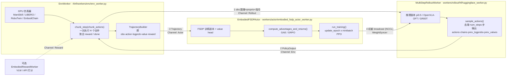
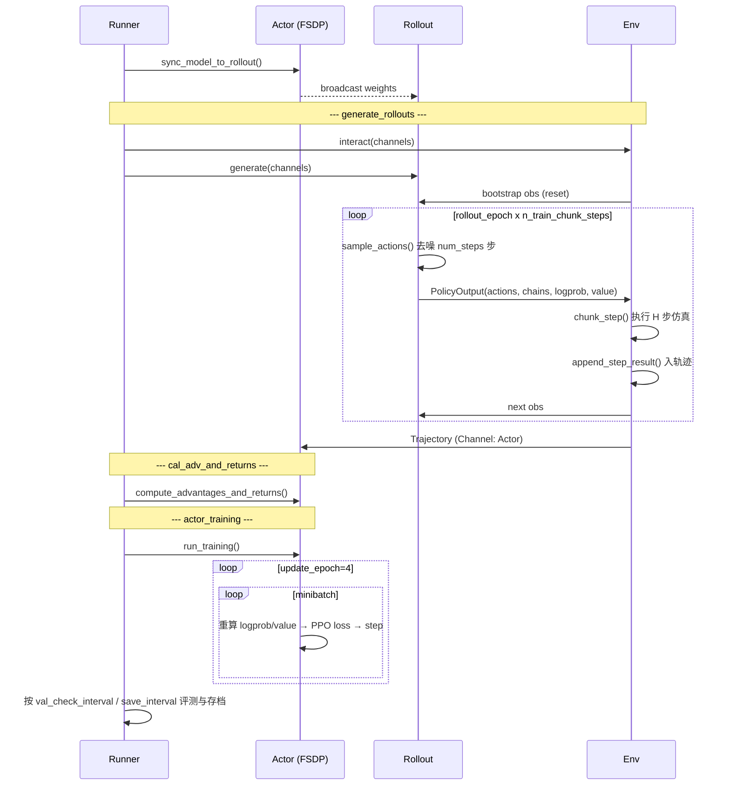
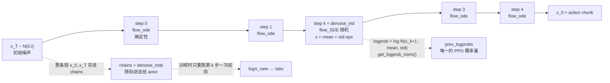

# RLinf 是怎么用 PPO 后训练 VLA 的

> 代码依据：`/home/phl/workspace/RLinf`（commit `92074930`）。
> 下面所有文件路径都相对 RLinf 仓库根目录。

## 0. 一句话概括

RLinf 把 **"生成一次 action chunk"** 当作 RL 的一个决策步，
用 **flow-matching 去噪链上的一步高斯扰动（flow-SDE）** 造出可求导的 log-prob，
用挂在 VLM / action-expert 上的 **value head** 当 critic，
剩下的就是教科书版 PPO（GAE + ratio clip + value clip）。
系统层面拆成 **env / rollout / actor 三组 worker**，用 channel 做流水，
每个 global step 之后把 actor 的权重 broadcast 回 rollout。

三件事分别对应三张图：
- 图 1：三组 worker 怎么摆、数据怎么流
- 图 2：一个 global step 的时间线
- 图 3：flow-matching 策略的 log-prob 从哪来（**整套方案的核心**）

---

## 1. 图 1：系统结构与数据流



三组 worker 由 `HybridComponentPlacement` 放到 GPU 上。配置里一行决定共享还是分离：

```yaml
cluster:
  component_placement:
    actor,env,rollout: all      # 共享式：三者轮流独占同一批 GPU
    # actor: 0-3                # 分离式：各占各的
    # env,rollout: 4-7
```

**关键点**：rollout 和 actor 是**同一个模型的两份副本**，不是两个模型。
每个 global step 开头（`weight_sync_interval` 默认 1，即完全 on-policy）
actor 把 sharded state dict broadcast 给 rollout（`sync_model_to_rollout` /
`sync_model_from_actor`）。

---

## 2. 图 2：一个 global step 的时间线

`EmbodiedRunner.run()`（`rlinf/runners/embodied_runner.py:479`）的主循环：



一个 global step 到底采多少数据，由这几个数决定（以
`examples/embodiment/config/libero_10_ppo_openpi_pi05.yaml` 为例）：

| 配置 | 值 | 含义 |
|---|---|---|
| `env.train.total_num_envs` | 64 | 并行环境数 |
| `env.train.rollout_epoch` | 8 | 一个 global step 内重置并跑几遍 |
| `env.train.max_steps_per_rollout_epoch` | 480 | 每遍的仿真步上限 |
| `actor.model.num_action_chunks` | 10 | 一个 chunk 执行多少步（记作 H） |
| ⇒ `n_train_chunk_steps` | 480/10 = **48** | 每遍的**决策步**数 |
| ⇒ 一个 global step 的样本 | 64 × 8 × 48 = **24576** | chunk-level transition |
| `actor.global_batch_size` / `micro_batch_size` | 2048 / 128 | |
| `algorithm.update_epoch` | 4 | ⇒ 每 step 约 12 × 4 = 48 次优化 |

启动就是一行：`bash examples/embodiment/run_embodiment.sh libero_10_ppo_openpi_pi05`。

---

## 3. MDP 是怎么定义的：chunk-level

这是 VLA 做 RL 和 LLM 做 RL 最大的结构差异。VLA 一次吐 H 步动作，
如果按单步 MDP 建模，动作之间的因果就断了。RLinf 的选择是**把整个 chunk 当一个动作**：

| MDP 要素 | 实现 |
|---|---|
| 状态 s | 多路相机图像 + proprio state + 语言指令（`obs_processor`，`openpi_action_model.py:802`）|
| 动作 a | 整个 chunk，形状 `[H, action_dim]` |
| reward | chunk 内 H 步 reward **求和**：`rewards.sum(dim=-1)`（`algorithms/utils.py:82`）|
| done | chunk 内 **any** done：`dones.max(dim=-1)`|
| 截断 bootstrap | truncation 时给最后一步补 `gamma * V(final_obs)`（`env_worker.py:775`）|

粒度由 `algorithm.reward_type` 控制：

- `chunk_level`（pi0.5 默认）：一个 chunk 一个 reward、一个 advantage、一个 ratio。
- `token_level`：保留 chunk 内逐动作的粒度，`[n_chunk_step, bsz, H]` 不塌缩。

被截断的 episode 不能当成"失败"来算 return，所以 rollout worker 会对 `final_obs`
额外跑一次前向拿 `bootstrap_values`（`huggingface_worker.py:613`），env worker
把它折进最后一步 reward。这是长 horizon 任务（500 步）能不能学起来的关键细节之一。

---

## 4. 图 3：核心难点 —— flow-matching 策略的 log-prob

PPO 需要 `ratio = exp(logπ_new − logπ_old)`。OpenVLA 这类自回归 VLA 直接有 token 概率，
但 **pi0 / pi0.5 是 flow matching**：推理是确定性的 Euler ODE，
`x ← x + v_θ(x,t)·Δt`，跑 `num_steps` 步（默认 5）出 chunk —— **确定性映射没有概率密度**。

RLinf 的解法：**把去噪链上的某一步换成随机的 SDE 步**，这一步是显式高斯，log-prob 可以闭式写出。



对应代码 `rlinf/models/embodiment/openpi/openpi_action_model.py`：

**采样侧**（`_sample_actions_with_prefix_cache`, 行 1005–1118）
1. 训练模式下随机抽一个去噪索引 `k = random.randint(0, num_steps-1)`（行 1054），**整个 batch 共用一个 k**。
2. 循环去噪，只有 `idx == k` 那步用 `noise_method`（默认 `flow_sde`），其余走 `flow_ode`。
3. `flow_sde` 的均值/方差（行 1176–1183）：
   `σ_i = noise_level·sqrt(t/(1−t))`，`std = sqrt(Δ)·σ_i`，
   并在 x1 权重里减掉 `σ_i²Δ/(2t)` 做漂移修正。
4. `x = mean + eps·std` 之后，`get_logprob_norm(x, mean, std)` 给出逐元素高斯 log-prob（行 1287）。
5. 存下 `chains`（全部 `num_steps+1` 个中间 `x_t`）、`denoise_inds`、`prev_logprobs`、`prev_values`。

**训练侧**（`get_log_prob_value`, 行 1305–1368）
拿 `chains[k]` 和 `chains[k+1]`，用**新权重**重跑第 k 步的 velocity 前向，
得到新的 `mean/std`，对**同一个** `chains[k+1]` 求 log-prob → 这就是 `logπ_new`。
所以一次 PPO 前向只付 **1 步去噪**的代价，而不是 5 步。

**四种 noise_method**：

| method | std | 用途 |
|---|---|---|
| `flow_ode` | 0 | 评测/确定性执行（eval 时 `denoise_inds = -1`，全程 ODE）|
| `flow_sde` | `sqrt(Δ)·σ_i` | **PPO 默认**，探索来源 |
| `flow_cps` | `(t−Δ)·sin(π·noise_level/2)` | 另一种噪声调度 |
| `flow_noise` | 网络 `ExploreNoiseNet` 学出来 | 唯一能算 entropy 的模式 |

**两个开关值得注意**：
- `joint_logprob=False`（默认）：只有一步是随机的，用**这一步**的 log-prob 当整条 chunk 的代理。
  便宜，但 ratio 只反映一步的策略变化。
- `joint_logprob=True`：每步都是 SDE，log-prob 对所有步取均值，再加上初始噪声项。更贵更准。
- `noise_method != flow_noise` 时 entropy 恒为 0 —— 所以 pi0.5 的默认配置里 `entropy_bonus: 0`，
  想开 entropy 正则必须换 `flow_noise`。

---

## 5. Critic 挂在哪

`add_value_head: True` 时加一个 MLP value head（`openpi_action_model.py:181`），输入有两种取法：

- `value_after_vlm: True`（pi0.5 的 LIBERO 配置用这个）：从 **VLM prefix 输出**取，
  按 `value_vlm_mode`（`mean_token` / `last_token` / `first_token`）对 968 个 prefix token
  做 mask 平均 → 2048 维 → `(1024,512,256)` MLP → V。每个 chunk 只算一次。
- `value_after_vlm: False`：从 **action expert 的 suffix_out** 取，对每个去噪步都算一个 V，
  最后对去噪步取平均。可配 `detach_critic_input`（切断到 expert 的梯度）、
  `chunk_critic_input`（只用前 `action_chunk` 个 token）。

critic 与 actor 共享主干、**共用一个优化器但两组学习率**（`optim.lr: 5e-6` vs
`optim.value_lr: 1e-4`），可以设 `critic_warmup_steps` 先只训 critic
（`critic_warmup` 期间 policy loss 直接置 0，`losses.py:282`）。

---

## 6. Advantage 与 Loss

**形状变换**（`algorithms/utils.py:67` `preprocess_embodied_advantages_inputs`）：
`[n_chunk_step, bsz, H]` → chunk_level 塌缩成 `[n_chunk_step, bsz, 1]` → 展平成 `[n_steps, bsz]`，
之后就跟普通 PPO 的时间序列一模一样。

**advantage**（`algorithm.adv_type`）：
- `gae`：标准 GAE，`gamma=0.99`、`gae_lambda=0.95`，`values=None` 时自动退化成
  critic-free 的 REINFORCE-style return（`advantages.py:61`）。
- `grpo`：组内标准化，不需要 critic，`group_size` 个 rollout 一组。
  pi0.5 也有对应的 `libero_*_grpo_openpi_pi05.yaml`。

**loss**（`algorithm.loss_type: actor_critic`，`algorithms/losses.py`）：

```
L = max(-A·r, -A·clip(r, 1-0.2, 1+0.2))        # PPO clip
    然后 min(·, sign(A)·clip_ratio_c·A)         # dual-clip, c=3.0
  + huber(returns - clip(V, V_old±0.2), δ=10)  # value clip
  - entropy_bonus · H                           # 默认 0
  + sft_loss_weight · L_sft                     # 可选，防遗忘
```

**ratio 的粒度** 由 `algorithm.logprob_type` 决定（`utils.py:310`）：

| logprob_type | logprob 形状 | 含义 |
|---|---|---|
| `token_level` | `[bsz, H, action_dim]` | 每个动作维度一个 ratio |
| `action_level` | `[bsz, H]` | 每步动作一个 ratio（对 action_dim 求和）|
| `chunk_level` | `[bsz]` | **pi0.5 默认**：整个 chunk 一个 ratio |

**几个实用开关**：
- `filter_rewards`：组内平均 reward 落在 `[lower, upper]` 之外的整组丢弃（全对/全错的组不提供梯度）。
- `enable_sft_co_train`：混一路 LeRobot SFT 数据一起训，缓解 RL 把预训练能力训崩。
- `runner.use_training_pipeline`：env worker 侧先打包 micro-batch 流式发给 actor，
  rollout 还没跑完 actor 就能开始训（只支持 `adv_type: gae`）。
- 异步版：`AsyncPPOEmbodiedRunner` + `weight_sync_interval: 30`，允许 off-policy 落后。

---

## 7. 落到 RoboSynChallenge 上要动什么

（结合本项目已有的调研结论）

1. **EmbodiChain 适配器只做到 CartPole**。`rlinf/envs/embodichain/embodichain_env.py`
   已经有 `chunk_step()`——正是上面 chunk-level MDP 需要的接口——但 `_wrap_obs()`
   只取 robot 的 qpos/qvel/qf 拼成 `{"states": ...}`，**没有图像通路**。
   加三路相机（`cam_high` / `cam_left_wrist` / `cam_right_wrist` 的 `/color`）+ 语言指令，
   是本项目唯一的主要代码工作量。
2. **模板选 RoboTwin ALOHA 双臂**，不要用 LIBERO（单臂 7 维）。
   参考 `robotwin_aloha_dataconfig.py` / `aloha_policy.py` /
   `examples/embodiment/config/robotwin_adjust_bottle_ppo_openpi_pi05.yaml`。
   CobotMagic 是双臂 14 维，且 `policy/pi05/pi_model.py` 本来就 import `aloha_policy`。
3. **权重转换**：`rlinf/utils/ckpt_convertor/convert_openpi_jax_to_python.py`，
   `--checkpoint_dir` 必须指到 `.../<step>/params` 那一层（它从 `parent/assets` 拷 norm_stats）。
4. **reward 载体是 task 的 `is_task_success()`**，不是 `base_env.get_reward()`（默认全 0）。
   注意部分 task 的 `compute_task_state` 故意返回全 False 让 episode 跑满 500 步，
   真实成败另存在实例属性里；PPO 要"成功即终止"得改这里。
   另外 main 分支上部分 `*Test` 变体的 `is_task_success` 直接 `return torch.ones(...)`，
   恒真 reward 会让 PPO 学出垃圾，用之前逐 task 核。
5. **任务从高基线起步**：mixer_operating(85%) / water_pouring(80%) / click_bell(73%)，
   和 RLinf 验证过的区间一致；sample_loading(3%)、item_assembly(16%) 稀疏 reward 下起不来。
6. **未验证的风险**：EmbodiChain 带 3 相机渲染 + 500 步 episode + 每 10 步随机光照时，
   `num_envs` 的吞吐/显存曲线。RLinf 的 EmbodiChain 例子是 CartPole 无渲染。
   这条曲线定 rollout 规模和所有 batch size，应该第一个测。

---

## 8. 代码位置速查

| 做什么 | 文件 |
|---|---|
| 入口 | `examples/embodiment/train_embodied_agent.py` |
| 主循环 | `rlinf/runners/embodied_runner.py:479` |
| 环境交互 / chunk_step | `rlinf/workers/env/env_worker.py:486`, `:1101` |
| 采样 + logprob | `rlinf/workers/rollout/hf/huggingface_worker.py:471` |
| PPO 训练 | `rlinf/workers/actor/embodied_fsdp_actor_worker.py:483` |
| flow-SDE 采样与 logprob | `rlinf/models/embodiment/openpi/openpi_action_model.py:1005`, `:1287`, `:1305` |
| value head | 同上 `:181`, `:1274`, `:1370` |
| GAE / GRPO | `rlinf/algorithms/advantages.py` |
| PPO / value loss | `rlinf/algorithms/losses.py:170`, `:315` |
| 形状与粒度变换 | `rlinf/algorithms/utils.py:67`, `:280` |
| pi0.5 PPO 配置 | `examples/embodiment/config/libero_10_ppo_openpi_pi05.yaml` |

## 9. 还需要实测确认的点

- `train_expert_only: True`（`model/pi0_5.yaml` 默认）在 openpi 的 PyTorch 路径下
  只出现在 `_no_split_modules`（影响 FSDP 包装粒度），**是否真的冻结 VLM 需要打印
  `requires_grad` 实测**，不要想当然。
- `joint_logprob=False` 时整个 batch 共用同一个去噪索引 k，
  batch 内没有 k 的多样性 —— 对梯度方差的影响没有公开消融。
- chunk-level ratio 把 `H × action_dim` 个高斯 log-prob 求和成一个标量，
  数值范围会随 H 变大，`clip_ratio=0.2` 的有效性对 H 敏感。
